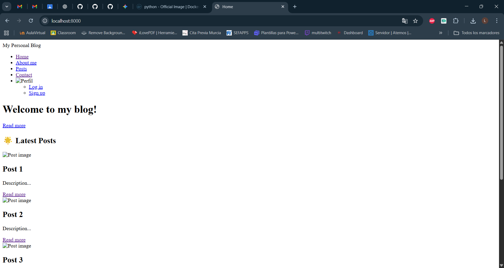

# Docker Compussy en Práctica 'Personal Blog'

## ¿Qué hemos hecho en esta tarea?

Inicialmente, en esta tarea hemos creado nuestro `Dockerfile` y nuestro `compose.yaml` para dockerizar la práctica. Hemos hecho lo mismo de siempre; un Dockerfile, y un compose.yaml donde creamos un contenedor web que construya la imagen desde el Dockerfile, exponga el puerto 8000 y usamos dos comandos (uno q aplique migraciones antes de arrancar, y otro que arranca el servidor)

# Stage 1

En esta fase, el objetivo es pasar del servidor de desarrollo de Django a un servidor de producción con Gunicorn.

Para eso, eliminamos el paquete `django-browser-reload` de los archivos `settings.py`, `requirements.txt` y `urls.py`, ya que este paquete solo sirve para desarrollo (lo que hace es recargar la web automáticamente cuando se cambia algo). Cambiamos también el comando de ejecución. Antes teníamos `python manage.py runserver 0.0.0.0:8000` y ahora tendremos `gunicorn personalblog.wsgi:application --bind 0.0.0.0:8000`. Posteriormente levantamos el servicio web con Docker Compose.

Podemos observar que nos aparece la página sin estilo. Esto es lo que se va a solucionar en la Stage 2.

# Stage 2

¿Por qué nos aparecía la página sin estilo? Porque Gunicorn no sabe servir los archivos estáticos de Django. Por eso el objetivo de esta fase es añadir `Nginx` para servir los archivos estáticos y que haga de Reverse Proxy.