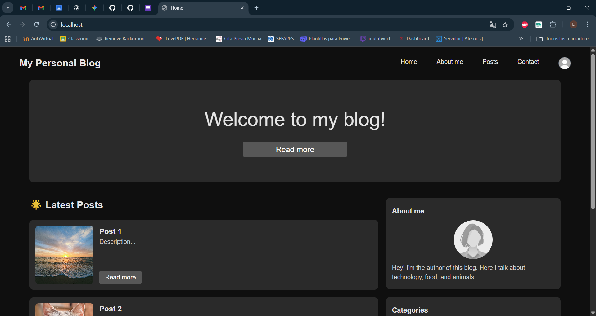

### Docker Compussy en Práctica 'Personal Blog'

## Dev Stage

Inicialmente, en esta tarea hemos creado nuestro `Dockerfile` y nuestro `compose.yaml` para dockerizar la práctica. Hemos hecho lo mismo de siempre, un Dockerfile donde:

1. Usamos la imagen de python.
2. Establecemos el directorio de trabajo del contenedor (/app).
3. Instalamos dependencias (a partir de requirements.txt).
4. Copiamos todo el código del proyecto al contenedor.
5. Exponemos en el puerto 8000.

```
FROM python:3.11
WORKDIR /app
COPY requirements.txt .
RUN pip install --no-cache-dir -r requirements.txt
COPY . .
EXPOSE 8000
```

y un compose.yaml donde creamos un contenedor web que:

1. Construye la imagen usando nuestro Dockerfile.
2. Mapeamos el puerto 8000 del contenedor al puerto 8000 host.
3. Aplicamos 2 comandos: uno que aplica migraciones y otro que arranque el servidor de desarrollo con runserver.

```
services:
  web:
    build: .
    ports:
      - "8000:8000"
    command: >
      sh -c "python manage.py migrate --noinput &&
      python manage.py runserver 0.0.0.0:8000"
```

## Stage 1

En esta fase, el objetivo es pasar del servidor de desarrollo de runserver a un servidor de producción con Gunicorn.

Para eso, eliminamos el paquete `django-browser-reload` de los archivos `settings.py`, `requirements.txt` y `urls.py`, ya que este paquete solo sirve para desarrollo (lo que hace es recargar la web automáticamente cuando se cambia algo). 

En nuestro archivo `compose.yaml` cambiaremos también el comando de ejecución. Antes teníamos `python manage.py runserver 0.0.0.0:8000` y ahora tendremos `gunicorn personalblog.wsgi:application --bind 0.0.0.0:8000`.

```
services:
  web:
    build: .
    ports:
      - "8000:8000"
    command: >
      sh -c "python manage.py migrate --noinput &&
      gunicorn personalblog.wsgi:application --bind 0.0.0.0:8000"
```

Posteriormente levantamos el servicio web con Docker Compose.


Podemos observar que la web responde, pero no contiene estilo ni archivos estáticos. Esto es lo que se va a solucionar en la Stage 2.

## Stage 2

# ¿Por qué nos aparecía la página sin estilo? 

Porque Gunicorn no sabe servir los archivos estáticos de Django. En desarrollo se hacía con 'runserver', pero en producción hay que usar otra alternativa. Por eso el objetivo de esta fase es añadir `Nginx` para servir los archivos estáticos y que haga de reverse proxy hacia Gunicorn.

En nuestro `settings.py`, tenemos que añadir `STATIC_ROOT = BASE_DIR / 'staticfiles'`. Básicamente estamos definiendo el destino de todos los archivos estáticos cuando ya estamos en producción. Más adelante aplicaremos el comando `collectstatic` que lo que hará es copiar todos nuestros archivos estáticos a esa carpeta que acabamos de definir, en mi caso `staticfiles`.

Crearemos también un archivo de configuración nginx (default.conf) en el que:
1. Nginx escucha en el puerto 80 (y acepta cualquier host).
2. Declaramos dónde se encuentran los archivos estáticos y los archivos 'media' dentro del contenedor para que Nginx lo encuentre.
3. Reenviamos las peticiones HTTP a web en su puerto 8000.
4. Definimos headers.

```
server {
    listen 80;
    server_name _;

    location /static/ {
        alias /app/staticfiles/;
    }

    location /media/ {
        alias /app/media/;
    }

    location / {
        proxy_pass http://web:8000;
        proxy_set_header Host $host;
        proxy_set_header X-Real-IP $remote_addr;
        proxy_set_header X-Forwarded-For $proxy_add_x_forwarded_for;
        proxy_set_header X-Forwarded-Proto $scheme;
    }
}
```

En nuestro contenedor web, declaro el volumen Docker `staticfiles`, que compartirá los archivos estáticos entre el contenedor web y el contenedor nginx. Lo declaramos de forma global para que sea persistente, y lo montaremos en nuestros dos servicios. Así, Django podrá copiar los archivos estáticos en el volumen y nginx podrá leerlos para servirlos.

Añadiremos el comando `python manage.py collectstatic --noinput` justo antes del comando que lanza Gunicorn. También montamos el volumen `staticfiles` en la ruta `/app/staticfiles`.

Añadiremos también el servicio `nginx`, que como ya he dicho actuará de reverse proxy. Este servicio:
1. Usa la imagen oficial de Nginx.
2. Publica el puerto 80 del contenedor al host. Ahora accederemos desde http://localhost.
3. Volúmenes: montamos la carpeta local de nuestro archivo de configuración de nginx a `/etc/nginx/conf.d` del contenedor, el volumen `staticfiles` (desde el que nginx va a servir los archivos estáticos), y la carpeta local `./media` a `/app/media` del contenedor.
4. Indicamos que depende del servicio web, es decir, que primero se arrancará web y luego nginx.

`compose.yaml`
```
services:
  web:
    build: .
    ports:
      - "8000:8000"
    command: >
      sh -c "python manage.py migrate --noinput &&
      python manage.py collectstatic --noinput &&
      gunicorn personalblog.wsgi:application --bind 0.0.0.0:8000"
    volumes:
      - staticfiles:/app/staticfiles

  nginx:
    image: nginx:alpine
    ports:
      - "80:80"
    volumes:
      - ./nginx/conf.d:/etc/nginx/conf.d
      - staticfiles:/app/staticfiles
      - ./media:/app/media
    depends_on:
      - web

volumes:
  staticfiles:
```



En resumen, lo que hemos hecho en esta segunda fase ha sido permitir que:
- Django copie los archivos estáticos al volumen `staticfiles` mediante `collectstatic`.
- Nginx lea esos archivos desde el mismo volumen y los sirva al navegador.
